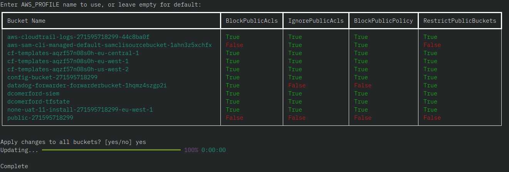

# s3-remove-public-access

This script will enable the public blocks for all S3 buckets in an AWS account.  
So make sure you don't have any static website hosting buckets because this will remove access.

## Requirements

- boto3
- rich

## Quickstart

```bash
python3 -m venv .venv
source .venv\bin\activate
pip install -r requirements.txt
python s3-block.py
```

## Preview


